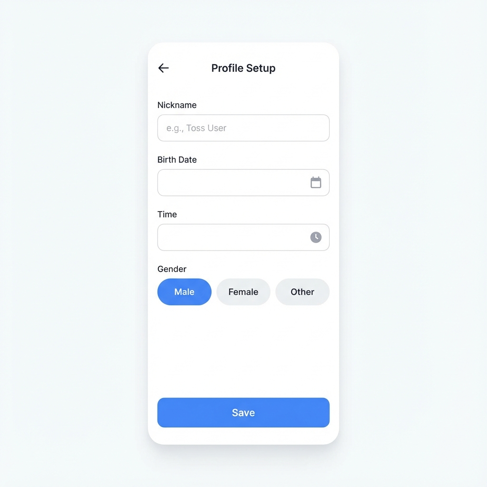
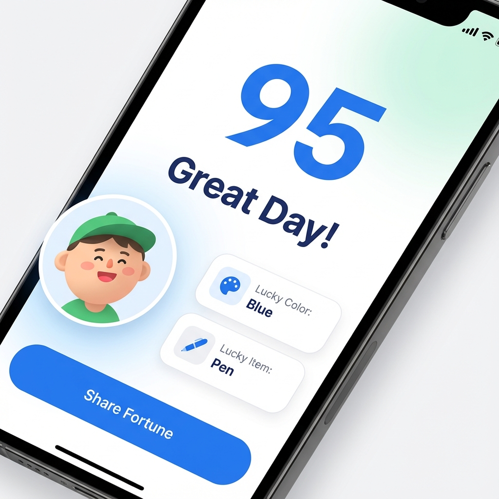

# 📄 추가된 페이지 목록 및 수정 보고 (Page List & Fix Report)

## 🛠 수정 사항: 프로필 입력 화면 '흰 화면(Blank Screen)' 문제 해결
사용자가 QR 코드로 접속 시 **프로필 입력**이나 **꿍친 추가** 버튼을 누르면 앱이 멈추는(White Screen) 현상이 보고되었습니다.

### 원인 및 조치
- **원인**: `TDS-Mobile` 라이브러리의 일부 컴포넌트(`FixedBottomCTA` 등)가 특정 모바일 환경(Native Bridge 미연동 상태 등)에서 렌더링될 때 런타임 에러를 유발한 것으로 파악되었습니다. 
- **조치**: 
    1. `src/pages/Profile.tsx`에서 에러를 유발할 수 있는 `FixedBottomCTA`를 제거하고, 안전한 표준 `fixed` 스타일 레이아웃으로 변경했습니다.
    2. `Checkbox` 컴포넌트의 사용 방식을 보다 안전하게(자식 요소 없이) 수정했습니다.
    3. 로컬 개발 환경과 프로덕션 환경의 `Provider` 설정을 점검했습니다.

---

## 📱 앱 주요 페이지 (Screen List)

현재 구현되어 배포된 주요 페이지는 다음과 같습니다.

### 1. 홈 화면 (Home Screen)
- **기능**: 나의 프로필 카드와 친구(꿍친) 리스트를 보여줍니다. '내 운세 바로 보기' 버튼을 통해 오늘의 운세로 이동합니다.
- **주요 컴포넌트**: `ProfileCard`, `AddCard`, `Human Design Strategy`

### 2. 프로필 입력/수정 (Profile Input)
- **기능**: 사용자 및 친구의 생년월일, 성별, 태어난 시간을 입력받습니다. 사주/휴먼디자인 분석을 위한 필수 데이터를 수집합니다.
- **수정사항**: 안정성을 위해 하단 저장 버튼 영역을 재설계했습니다.

### 3. 오늘의 운세 결과 (Today's Fortune)
- **기능**: 분석된 데이터를 바탕으로 오늘의 종합 점수(0~100)와 행운 메시지를 보여줍니다.
- **연동 엔진**: 사주(Saju), 휴먼디자인(HD), 에니어그램 엔진이 종합적으로 계산에 참여합니다.

### 4. 프리미엄 리포트 (Premium Report)
- **기능**: (이미지 없음) 운세 결과에서 더 자세한 분석(동물 종족, 성향 키워드 등)을 볼 수 있는 상세 페이지입니다.
