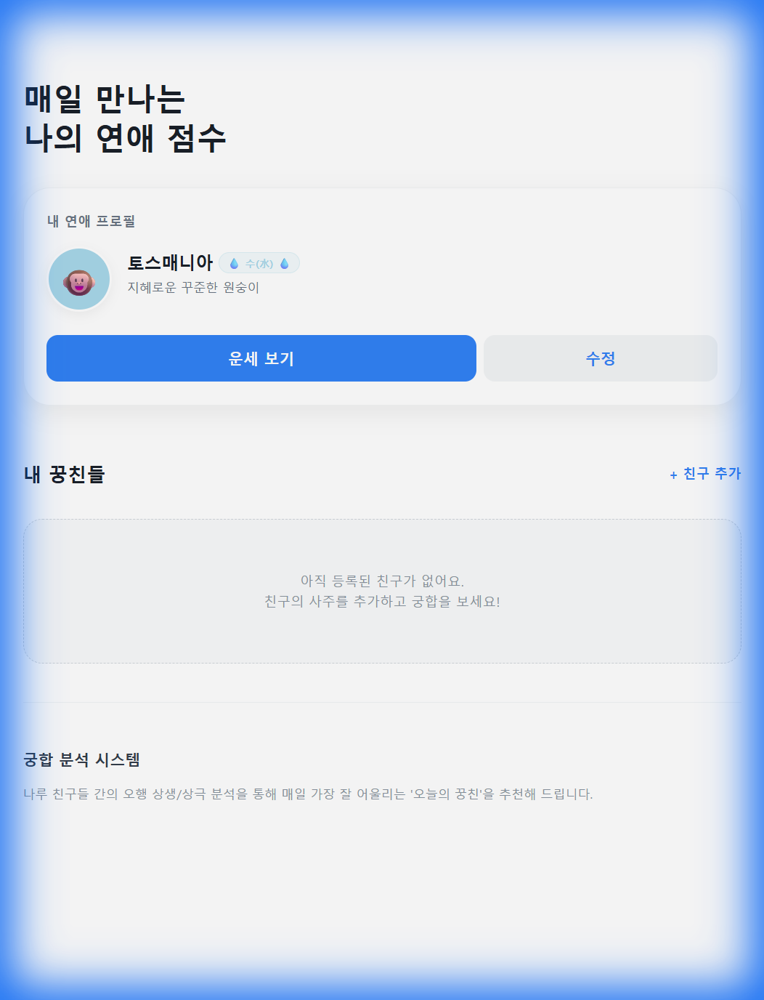
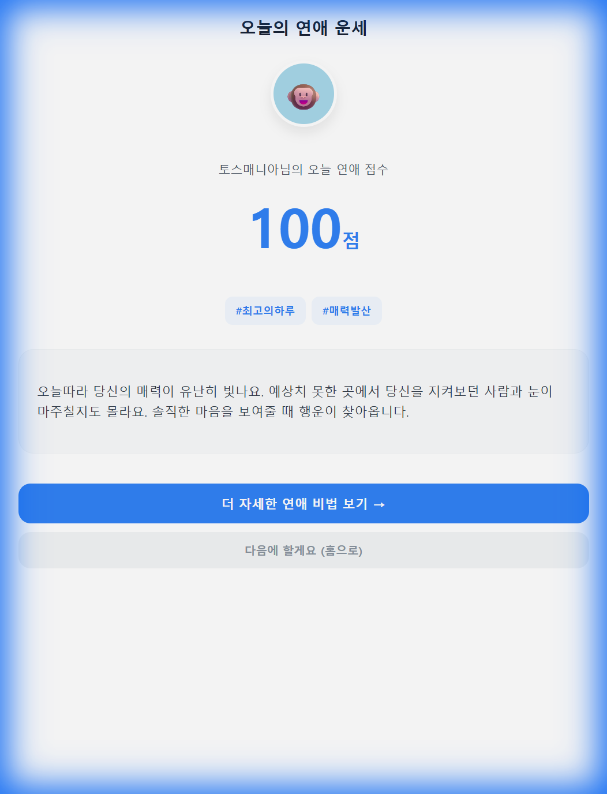
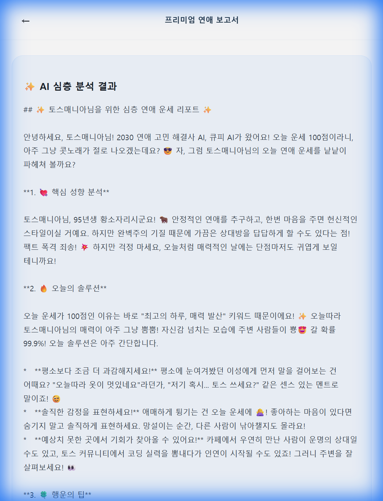

# 🚀 Pre-Launch Verification Report
**버전**: v1.0.0  
**검증 일시**: 2026-01-09 08:06 KST  
**검증자**: Antigravity Agent  

---

## ✅ 1. 자동화 검증 결과 (Automated QC)

| 검증 항목 | 명령어 | 결과 |
| :--- | :--- | :---: |
| **Lint Check** | `npm run lint` | ✅ Pass |
| **Logic & Integration Test** | `npm run test` | ✅ Pass (8/8) |
| **Type Check** | `npx tsc --noEmit` | ✅ Pass (No errors) |
| **Build** | `npm run build` | ✅ Pass |

**생성된 빌드 파일**: `todays-match.ait`

---

## ✅ 2. 재발 방지 검증 (Regression Check)

| 검증 항목 | 결과 | 비고 |
| :--- | :---: | :--- |
| 네비게이션바 아이콘 HTTPS 경로 | ✅ | `granite.config.ts` 확인 |
| 핵심 타입 정의 존재 | ✅ | `UserProfile`, `SajuElement`, `FortuneResult` |
| 광고 ID 변수 설정 | ✅ | `TEST_AD_GROUP_ID` = `ait.v2.live.f7cf74bd6b6b4c55` |
| API URL 하드코딩 | ✅ | `https://todaysmatch-423863342.us-central1.run.app` |

---

## ✅ 3. 웹 브라우저 시각 검증 (Visual Verification)

광고 기능을 임시 비활성화하고 모든 페이지의 렌더링을 확인했습니다.

### 3-1. 홈 페이지 (`/`)
- **확인 항목**: 캐릭터 아바타(원숭이 이모지), "운세 보기" 버튼
- **결과**: ✅ 정상

### 3-2. 프로필 수정 페이지 (`/profile`)
- **확인 항목**: 닉네임, 생년월일, 성별, 연애상태 입력 필드
- **결과**: ✅ 정상

### 3-3. 오늘의 운세 페이지 (`/today-fortune`)
- **확인 항목**: 점수(100점), 키워드(#최고의하루, #매력발산), 운세 메시지
- **결과**: ✅ 정상

### 3-4. 프리미엄 보고서 페이지 (`/premium-report`)
- **확인 항목**: 💎 아이콘, 광고 버튼, AI 심층 분석 결과 출력
- **결과**: ✅ 정상 (광고 시뮬레이션 후 AI 분석 결과 정상 출력)

---

## ✅ 4. 규정 준수 확인 (Regulation Check)

| 항목 | 상태 | 근거 |
| :--- | :---: | :--- |
| 핀치 줌 비활성화 | ✅ | `index.html`에 `user-scalable=no` 설정됨 |
| 개인정보 처리방침 페이지 | ✅ | `/privacy` 라우트 구현 완료 |
| TDS 스타일 준수 | ✅ | 커스텀 `ui.tsx` 컴포넌트 사용 |
| 광고 SDK 연동 | ✅ | `useRewardedAd.ts` 훅 구현 완료 |

---

## 📋 5. 최종 체크리스트

- [x] `npm run qc` 통과
- [x] `npx tsc --noEmit` 통과
- [x] `npm run build` 성공 (.ait 파일 생성)
- [x] 웹 브라우저 시각 검증 완료
- [x] 광고 기능 코드 복원 완료
- [x] 스크린샷 `docs/assets/`에 보관

---

## 🎯 6. 결론

**본 앱은 출시 준비가 완료되었습니다.**

다음 단계:
1. `todays-match.ait` 파일을 토스 개발자 콘솔에 업로드
2. 앱 심사 제출
3. 심사 통과 후 라이브 배포

---

*이 보고서는 `/qc-validation` 워크플로우에 따라 자동 생성되었습니다.*
